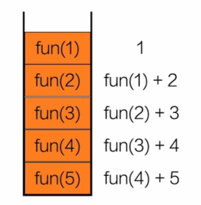

# 数据结构（C）

# 前置知识

### 内存分类

C程序编译后，会以**三种形式**

1.静态/全局内存

- 2.自动内存（栈内存）
    
    函数内部声明的变量使用这部分内存，在函数被调用时才创建
    
    
    
- 3.动态内存（堆内存）
    
    根据需求编写代码动态分配内存，可以编写代码释放，内存中的内容直到释放才消失
    
    - 动态分配内存的基本步骤：
        
        1.使用malloc函数分配内存
        
        **void*** malloc(size_t);
        
        如果成功，会返回从堆内存上分配的内存指针
        
        如果失败，会返回空指针
        
        2.使用分配的内存
        
        3.使用free函数释放内存
        
        ```c
        #include<stdio.h>
        #include<stdlib.h>
        #include<string.h>
        int main{
        		int *p;
        		p=(int*)malloc(sizeof(int));
        		*p=15;
        		printf("%d\n",*p);
        		free(p);
        		
        		char *s;
        		s=(char*)malloc(sizeof(10));
        		strcpy(s,"Hello");
        		printf("%s\n",s);
        		free(s);
        		
        		int *arr=(int*)malloc(5*sizeof(int));
        		for(int i=0;i<5;i++){
        				arr[i]=0;
        		}
        		free(arr);
        		
        		typedef struct {
        				int x;
        				int y;
        		}po;
        		po *pt;
        		pt=(po*)malloc(sizeof(po));
        		pt->x=5;
        		pt->y=10;
        		free(pt);
        		return 0;
        }
        ```
        

# 算法分析

### 时间复杂度

T(n)=O(f(n))

执行每条语句的耗时，每条语句的执行频率

1.当执行频率为常数时，算法时间复杂度都是O(1)

2.看最复杂的时间复杂度，同阶无穷大，抓大头 

3.找到频率（执行次数）与n的函数关系，t=f(n)

```c
//例1
int sum=0;
for(i=1;i<n;i*=2){
		for(int j=0;j<i;j++){
				sum++;
		}
}
//外层循环了O(log n)次
//外层循环变量i最后一次取值i≈n/2
//内层循环最大循环O(n)次
```

**空间复杂度**

**ADT**

# 线性表

### 顺序表

```c
typedef int ELemType;
typedef struct {
	ELemType data[MAXSIZE];
	int length;
}SeqList;
seqlist* intilist(seqlist* l) {
	l = (seqlist*)malloc(sizeof(seqlist));
	l->data = (ELemType*)malloc(sizeof(ELemType) * MAXSIZE);
	l->length = 0;
	return l;
}
int appendElem(SeqList* L, ELemType e) {
	if (L->length == MAXSIZE) {
		printf("顺序表已满\n");
		return 0;
	}
	L->data[L->length] = e;
	L->length++;
	return 1;
}
void listElem(SeqList* L) {
	for (int i = 0; i < L->length; i++) {
		if (i > 0) {
			printf(" ");
		}
		printf("%d", L->data[i]);
	}
	printf("\n");
}
int insertElem(SeqList* L, int pos, ELemType e) {
	if (pos<1 || pos>L->length + 1) {
		printf("插入位置有误\n");
		return 0;
	}
	if (L->length >= MAXSIZE) {
		return 0;
	}
	for (int i = L->length; i >= pos; i--) {
		L->data[i] = L->data[i - 1];
	}
	L->data[pos - 1] = e;
	L->length++;
	return 1;
}
int deleteElem(SeqList* L, int pos, ELemType* e) {
	*e = L->data[pos - 1];
	if (pos < L->length)
		for (int i = pos - 1; i < L->length - 1; i++) {
			L->data[i] = L->data[i + 1];
		}
	L->length--;
	return 1;
}
int findElem(SeqList* L, ELemType e) {
	for (int i = 0; i < L->length; i++) {
		if (L->data[i] == e) {
			return i + 1;
		}
	}
	return 0;
}
```

### 动态数组

```c
int *arr=(int*)malloc(sizeof(int)*(n+1));
//等价于arr[n+1];
for(int i=0;i<=n;i++){
		//*(arr+i)=arr[i];二者等价
}
```

### 链表

```c
typedef int ElemType;
typedef struct node {
	ElemType data;
	struct node* next;
}Node;
Node* initList()
{
	Node* head = (Node*)malloc(sizeof(Node));
	head->data = 0;
	head->next = NULL;
	return head;
}
void insertHead(Node* L, ElemType e) {
	Node* p = (Node*)malloc(sizeof(Node));
	p->data = e;
	p->next = L->next;
	L->next = p;
}
void listNode(Node* L) {
	Node* p = L->next;
	while (p != NULL) {
		printf("%d ", p->data);
		p = p->next;
	}
	printf("\n");
}
Node* get_tail(Node* L) {
	Node* p = L;
	while (p->next != NULL) {
		p = p->next;
	}
	return p;
}
Node* insertTail(Node* tail, ElemType e) {
	Node* p = (Node*)malloc(sizeof(Node));
	p->data = e;
	tail->next = p;
	p->next = NULL;
	return p;//直接返回尾节点，不用再执行get_tail
}
void insertNode(Node* L, int pos, ElemType e) {
	Node* p = L;
	for (int i = 1; i < pos; i++) {
		p = p->next;
	}
	Node* q = (Node*)malloc(sizeof(Node));
	q->data = e;
	q->next = p->next;
	p->next = q;
}
void deleteNode(Node* L, int pos) {
	Node* p = L;
	for (int i = 1; i < pos; i++) {
		p = p->next;
	}
	Node* q = p->next;
	p->next = q->next;
	free(q);
}
int listLength(Node* L) {
	Node* p = L;
	int length = 0;
	while (p != NULL) {
		p = p->next;
		length++;
	}
	return length;
}
void freeList(Node* L) {
	Node* p = L->next;
	Node* q;
	while (p != NULL) {
		q = p->next;
		free(p);
		p = q;
	}
	L->next = NULL;
}
```

### 链表应用

**找倒数第K个节点的数据**：利用快慢双指针，快指针先走K步，然后一起走
**找两个字符的共同后缀**：也可以利用快慢指针，快指针走’差值‘步，然后比较地址

**删除链表中间节点**：利用快慢双指针，快指针走2步，慢指针走1步

**反转链表**：利用三个指针,First,Second,Third

**首尾交叉链表**：1.找中间节点 2.反转后半链表 3.两个链表交叉组合

**判断链表是否带环**：快慢指针能否碰到

**寻找入环口**：记录快慢指针的相遇点，再来两个指针 一个从头开始，一个从相遇点开始，步长都为1，一直走到相遇的地方就是入口

# 栈与队列

### 顺序表实现栈

```c
typedef int ElemType;
typedef struct {
	ElemType data[MAXSIZE];
	int top;
}Stack;
void initStack(Stack* s) {
	s->top = -1;
}
void push(Stack* s, ElemType e) {
	if (s->top >= MAXSIZE - 1) {
		printf("已满！\n");
		return;
	}
	s->top++;
	s->data[s->top] = e;
}
int pop(Stack* s, ElemType* e) {
	if (s->top == -1) {
		printf("空栈.\n");
	}
	*e = s->data[s->top];
	return *e;
}
//动态分配
typedef struct stack {
	ElemType* data;
	int top;
}Stack;
Stack* initStack() {
	Stack* s = (Stack*)malloc(sizeof(Stack*));
	s->data = (ElemType*)malloc(sizeof(ElemType) * MAXSIZE);
	s->top = -1;
	return s;
}
```

### 链表实现栈

压栈就是链表头插法

```c
typedef struct stack{
	ElemType data;
	struct stack* next;
}Stack;
Stack* initStack() {
	Stack* s = (Stack*)malloc(sizeof(Stack));
	s->data = 0;
	s->next = NULL;
	return s;
}
int pop(Stack* s, ElemType* e) {
	if (s->next == NULL) {
		printf("空栈\n");
		return 0;
	}
	*e = s->next->data;
	Stack* q = s->next;
	s->next = q->next;
	free(q);
	return *e;
}
```

### 后缀表达式

特点：运算符写在操作数后面，不需要加括号

中缀表达式：3 + 4 * 2

后缀表达式：3 4 2 * +

可以用**栈**来实现：

1.遇到数字→压入栈

2.遇到运算符→弹出两个数字计算，再把结果压回栈（先出的去op2）


```c
int push(Stack* s, ElemType e) {
	if (isFull(s)) {
		printf("已满!\n");
		return 0;
	}
	s->top++;
	s->data[s->top] = e;
	return 1;
}
int pop(Stack* s,ElemType*e){
	if (isEmpty(s)) {
		printf("空栈!\n");
		return 0;
	}
	*e = s->data[s->top];
	s->top--;
	return 1;
}
int evalPostfix(const char* expr) {
	Stack s;
	initStack(&s);
	int i = 0;
	while (expr[i] != '\0') {
		if (expr[i] == ' ') {
			i++;
			continue;
		}
		//实现多位数操作
		if (expr[i] >= '0' && expr[i] <= '9') {
			int num = 0;
			while (expr[i] >= '0' && expr[i] <= '9') {
				num = num * 10 + (expr[i] - '0');
				i++;
			}
				push(&s, num);
		}
		else {
			int a, b;
			pop(&s, &b);
			pop(&s, &a);
			int result;
			switch (expr[i]) {
			case'+':
				result = a + b;
				break;
			case'-':
				result = a - b;
				break;
			case'*':
				result = a * b;
				break;
			case'/':
				result = a / b;
				break;
			}
			push(&s, result);
		}
		i++;
	}
	int ans;
	pop(&s,&ans);
	return ans;
}
```

### 中缀表达式→后缀表达式

1.遇到数字直接输出

2.遇到运算符根据优先级处理

当一个新的运算符op来时，需要与栈顶的运算符比较优先级：

如果栈顶的优先级≥op，就把栈顶弹出

如果栈顶的优先级<op，op就压栈

3.遇到左括号’(’→进栈

进栈后优先级降为最低

4.遇到右括号’)’→一直把栈顶弹出直到遇到’(’

把 + 弹出  (输出)

遇到 ( → 丢掉它（不输出）

5.扫描结束→把所有栈都弹出

```c
// 假设：Stack 存的就是 char，栈顶为 -1 表示空栈
// 你需要有 isEmpty(s) 这个函数

void appendChar(char *str, char c) {
    int len = strlen(str);
    str[len] = c;
    str[len + 1] = '\0';
}

int priority(char op) {
    if (op == '+' || op == '-') return 1;
    if (op == '*' || op == '/') return 2;
    return 0;
}

void postfix(Stack* s, const char *expr1, char *expr2) {
    int i = 0;
    expr2[0] = '\0';      // 先把输出字符串置空
    s->top = -1;          // 初始化栈（如果你外面没初始化的话）

    while (expr1[i] != '\0') {
        char c = expr1[i];

        // 跳过空格
        if (c == ' ') {
            i++;
            continue;
        }

        // 数字：把整个多位数拷贝出去
        if (c >= '0' && c <= '9') {
            while (expr1[i] >= '0' && expr1[i] <= '9') {
                appendchar(expr2, expr1[i]);
                i++;
            }
            appendchar(expr2, ' ');  // 数字结束后加一个空格隔开
            continue;
        }

        // 左括号：直接入栈
        if (c == '(') {
            s->data[++(s->top)] = c;
            i++;
            continue;
        }

        // 右括号：弹到 '(' 为止
        if (c == ')') {
            while (!isEmpty(s) && s->data[s->top] != '(') {
                appendchar(expr2, s->data[s->top--]);
                appendchar(expr2, ' ');
            }
            if (!isEmpty(s) && s->data[s->top] == '(') {
                s->top--;  // 丢掉 '('
            }
            i++;
            continue;
        }

        // 剩下的就是运算符 + - * /
        if (c == '+' || c == '-' || c == '*' || c == '/') {
            // 按优先级把栈顶弹出来
            while (!isEmpty(s) &&
                   s->data[s->top] != '(' &&
                   priority(s->data[s->top]) >= priority(c)) {
                appendchar(expr2, s->data[s->top--]);
                appendchar(expr2, ' ');
            }
            // 当前运算符入栈
            s->data[++(s->top)] = c;
            i++;
            continue;
        }

        // 如果有奇怪字符，就直接跳过或报错
        i++;
    }

    // 扫描结束，把栈里剩余运算符全部弹出
    while (!isEmpty(s)) {
        if (s->data[s->top] != '(') {   // 理论上不该还有 '('
            appendchar(expr2, s->data[s->top]);
            appendchar(expr2, ' ');
        }
        s->top--;
    }
}

```

### 顺序表实现队列

需要两个“指针”：front,rear


```c
#define MAXSIZE 100
typedef int ElemType;
typedef struct {
	ElemType data[MAXSIZE];
	int front;
	int rear;
}Queue;
void initQueue(Queue* q) {
	q->front = 0;
	q->rear = -1;
}
int isEmpty(Queue* q) {
	if (q->front > q->rear) {
		return 1;
	}
	return 0;
}
ElemType dequeue(Queue* q) {
	if (q->front > q->rear) {
		return 0;
	}
	ElemType e = q->data[q->front];
	q->front++;
	return e;
}
int truefull(Queue* q) {
	if (q->front == 0) {
		return 1;
	}
	int len = q->front;
	int length = q->rear - q->front + 1;
	for (int i = 0; i < length; i++) {
		q->data[i] = q->data[i + len];
	}
	q->front = 0;
	q->rear = length - 1;
	return 0;
}
ElemType inqueue(Queue* q,ElemType e) {
	if (q->rear >= MAXSIZE - 1) {
		if (truefull(q)) {
			return 0;
		}
	}
	q->rear++;
	q->data[q->rear] = e;
	return e;
}
```

循环队列
与普通顺序列表不同的是：

1.初始化：front=0,rear=0

2.采用牺牲一个空位法：rear=“下一个插入的位置”

空队列：front==rear;

满队列：(rear+1)%MAXSIZE==front;

3.每次更新front,rear的值都需要取余：front=(front+1)%MAXSIZE

```c
void initQueue(Queue* q) {
	q->front = 0;
	q->rear = 0;
}
int inQueue(Queue* q, ElemType e) {
	if ((q->rear + 1) % MAXSIZE == q->front) {
		printf("满了\n");
		return 0;
	}
	q->rear = (q->rear + 1) % MAXSIZE;
	q->data[q->rear] = e;
	return 1;
}
```

**思考：能不能把循环队列存满？**

回答：可以，但是需要多一个记录长度的变量：

初始化rear=MAXSIZE-1；此时rear=”队尾节点”

如果还是只有front和rear两个变量，那么空队列和满队列的判断条件重合了！所以需要新变量size来记录链表的长度，size=0意味着空，size=MAXSIZE意味着满

```c
#define MAXSIZE 100
typedef int ElemType;

typedef struct {
    ElemType data[MAXSIZE];
    int front;  // 指向队头元素
    int rear;   // 指向队尾元素
    int size;   // 当前有效元素个数
} Queue;

// 初始化：空队列
void initQueue(Queue *q) {
    q->front = 0;
    q->rear  = MAXSIZE - 1;  // 这个时候 rear 的位置其实无所谓
    q->size  = 0;
}

// 判空：没有元素
int isEmpty(Queue *q) {
    return q->size == 0;
}

// 判满：装满 MAXSIZE 个
int isFull(Queue *q) {
    return q->size == MAXSIZE;
}

// 入队：rear 指向“队尾元素本身”
int enQueue(Queue *q, ElemType e) {
    if (isFull(q)) {
        printf("满了\n");
        return 0;
    }

    q->rear = (q->rear + 1) % MAXSIZE;  // 先往后挪一格
    q->data[q->rear] = e;               // 写入队尾
    q->size++;
    return 1;
}

// 出队：front 指向“队头元素本身”
int deQueue(Queue *q, ElemType *e) {
    if (isEmpty(q)) {
        printf("空了\n");
        return 0;
    }

    *e = q->data[q->front];             // 读出队头
    q->front = (q->front + 1) % MAXSIZE;
    q->size--;
    return 1;
}
```

### 链表实现队列

```c
typedef struct{
		ElemType data;
		QueueNode* next;
}QueueNode;
typedef struct {
		QueueNode* front;
		QueueNode* rear;
}Queue;
Queue* initQueue() {
		Queue * q = (Queue*)malloc(sizeof(Queue));
		QueueNode* node = (QueueNode*)malloc(sizeof(QueueNode));
		node->data = 0;
		node->next = NULL;
		q->front = node;
		q->rear = node;
		return q;
}
int isEmpty(Queue* q) {
		if (q->front == q->rear) {
				return 1;
		}
		return 0;
}
void inqueue(Queue* q, ElemType e) {
		QueueNode* node = (QueueNode*)malloc(sizeof(QueueNode));
		node->data = e;
		node->next = NULL;
		q->rear->next = node;//保证链表连接
		q->rear = node;//rear指向队尾元素
}
void dequeue(Queue* q, ElemType* e) {
		QueueNode* node = q->front->next;
		q->front->next = node->next;
		*e = node->data;
		if (q->rear == node) {
				q->rear = q->front;
		}
		free(node);
}
```

# 树与二叉树

### 树的概念

**树：**一个或多个结点的有限集合

**结点：**树中的一个独立单元

**结点的度：**结点拥有的子树被称为结点的度

**树的度：**树内各结点度的最大值

**叶子：**度为0的结点或终端结点

**非终端结点：**度不为0的结点

**双亲和孩子：**结点的子树的根称为该结点的孩子，相应地，该结点称为孩子的双亲

**层次：**结点的层次从根开始定义，根为第一层，根的孩子为第二层，以此类推

### 树的性质

**性质一：**树中所有结点数等于所有结点的度数之和加1（通俗讲就是圆=线+1）

